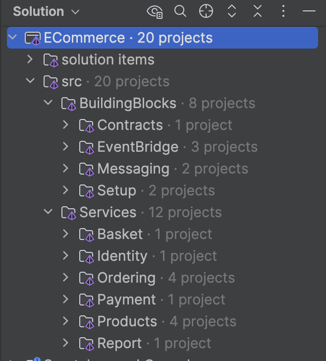

# Microservice eCommerce Platform

An event-driven eCommerce platform built using microservices architecture, leveraging Kafka for event streaming, NATS for real-time WebSocket communication,
and the outbox pattern with Debezium for reliable event publishing.

## System Architecture



The platform consists of the following microservices:

- **Basket API**: Shopping cart service built with Microsoft Orleans, using Local memory for data storage
- **Products API**: Product catalog service using Clean Architecture, MediatR and CQRS
- **Ordering API**: Order management service using Clean Architecture, MediatR and CQRS
- **Reports API**: Reporting service that consumes completed order events from Kafka, stores data in Elasticsearch and exposes reporting endpoints
- **Payment API**: Mock payment processing service that consumes events from Kafka and processes transactions with random success/failure results
- **Identity**: Authentication and authorization service implemented using Duende.IdentityServer

## Event-Driven Communication

The system uses an event-driven architecture with several communication mechanisms:

1. **Kafka**: Primary event bus for asynchronous communication between microservices
2. **NATS**: Used for WebSocket communication with the frontend for real-time updates
3. **Outbox Pattern**: Ensures reliable event publishing by storing events in the database before processing
4. **Debezium**: Captures changes from PostgreSQL and publishes them to Kafka

## BuildingBlocks

The project includes shared libraries in the BuildingBlocks folder:

- **EventBridge**: Custom library for working with Kafka, providing abstractions for event publishing and consumption
- **MessageBus**: Custom library for working with Nats, providing abstractions for message publishing for WebSocket

## Getting Started

### Prerequisites

- Docker and Docker Compose
- .NET 9.0 or higher

### Setting Up the Development Environment

1. Clone the repository
   ```bash
   git clone https://github.com/revazashvili/ecommerce-microservices.git
   cd ecommerce-microservices
   ```

2. Start the infrastructure services
   ```bash
   docker-compose up -d
   ```

3. Set up Debezium connectors
   ```bash
   ./setup_debezium.sh
   ```

## Database Migrations
Note: Migrations do not apply to database automatically on start up, you need to run ```./apply-migrations.sh``` manually

Each service that uses Entity Framework Core (Identity, Ordering, Products, and Payment) includes three shell scripts for database management:

- `add-migration.sh`: Creates a new migration
- `apply-migration.sh`: Applies pending migrations to the database
- `remove-migration.sh`: Removes the last migration

### Adding a new migration

```bash
cd ServiceName
./add-migration.sh "MigrationName"
```

### Applying migrations

```bash
cd ServiceName
./apply-migration.sh
```

### Removing the last migration

```bash
cd ServiceName
./remove-migration.sh
```

## Microservices Details

### Basket API

The Basket API is implemented using Microsoft Orleans, a virtual actor framework that simplifies the development of distributed systems. It uses Local memory as its data store for shopping cart information.

**Key Features:**
- High-throughput shopping cart operations
- Session-based cart management
- Real-time inventory validation
- Integration with Product API for product information

### Products API

The Products API is built using Clean Architecture principles, MediatR for command/query handling, and CQRS (Command Query Responsibility Segregation) for separating read and write operations.

**Key Features:**
- Product management
- Product Category management
- Search and filtering capabilities
- Product inventory management

### Ordering API

The Ordering API handles order processing and management, also implemented using Clean Architecture, MediatR, and CQRS patterns.

**Key Features:**
- Order creation and processing
- Order status tracking
- Integration with Basket API for checkout
- Publishing order events using the outbox pattern

### Reports API

The Reports API consumes order completion events from Kafka, stores data in Elasticsearch, and provides analytical reporting endpoints.

**Key Features:**
- Sales reports
- Order reports

### Payment API

Currently a mock service that simulates payment processing. It listens to Kafka for payment request events and returns random success or failure results.

**Key Features:**
- Mock payment processing
- Transaction status updates via events
- Integration with Ordering API

### Identity

Authentication and authorization service implemented using Duende.IdentityServer. Manages user identities, authentication, and API access control.

**Key Features:**
- User registration and authentication
- OAuth2 and OpenID Connect support
- API resource protection

## Outbox Pattern Implementation

The system uses the outbox pattern to ensure reliable event publishing:

1. When a state change occurs, the service writes both the state change and the corresponding event to the database in a single transaction
2. A separate process reads unpublished events from the outbox table and publishes them to Kafka

[Debezium](https://debezium.io/) is used to capture changes to the outbox tables and publish them to Kafka automatically.

## Event Structure

Events in the system follow a common structure:

```json
{
  "id": "unique-event-id",
  "aggregateId": "event-aggregate-id", 
  "topic": "kafka-topic",
  "payload": "event-payload",
  "timestamp": "2023-07-15T10:30:00Z"
}
```

## Configuration

Each microservice can be configured using environment variables or configuration files. See the `appsettings.json` files in each service for available options.

## Troubleshooting

### Event Issues

If services cannot connect to Kafka:

1. Check if Kafka and debezium containers are running
2. Verify network connectivity between debezium and Kafka
3. Check Kafka broker configurations
4. Check if debezium connectors exists, run ```./setup_debezium.sh``` if connector does not exists
5. Check if events are saved in database

## License

This project is licensed under the MIT License - see the LICENSE file for details.